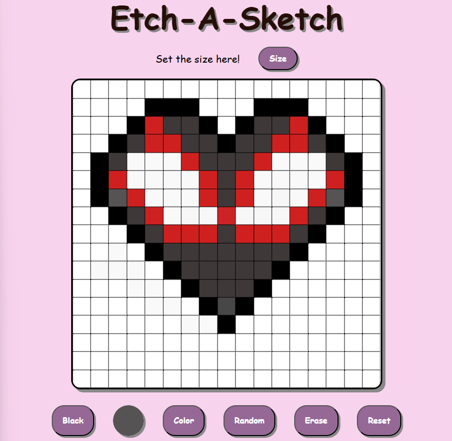

# Etch-A-Sketch

A browser based sketchpad built as part of The Odin Project using Javascript, DOM manipulation and flexbox.

## Live Demo

Link:  https://byjayashree.github.io/odin-Etch-a-Sketch/

## Preview 

## What I Learned

- DOM manipulation and event handling
- Managing application state (drawingMode)
- Creating dynamic layouts using flexbox
- Structuring code for readability

## Personal Note

This project helped me move from writing basic scripts to building interactive web applications.
It challenged my understanding of DOM manipulation, state management, and debugging — and pushed me to think like a developer. 